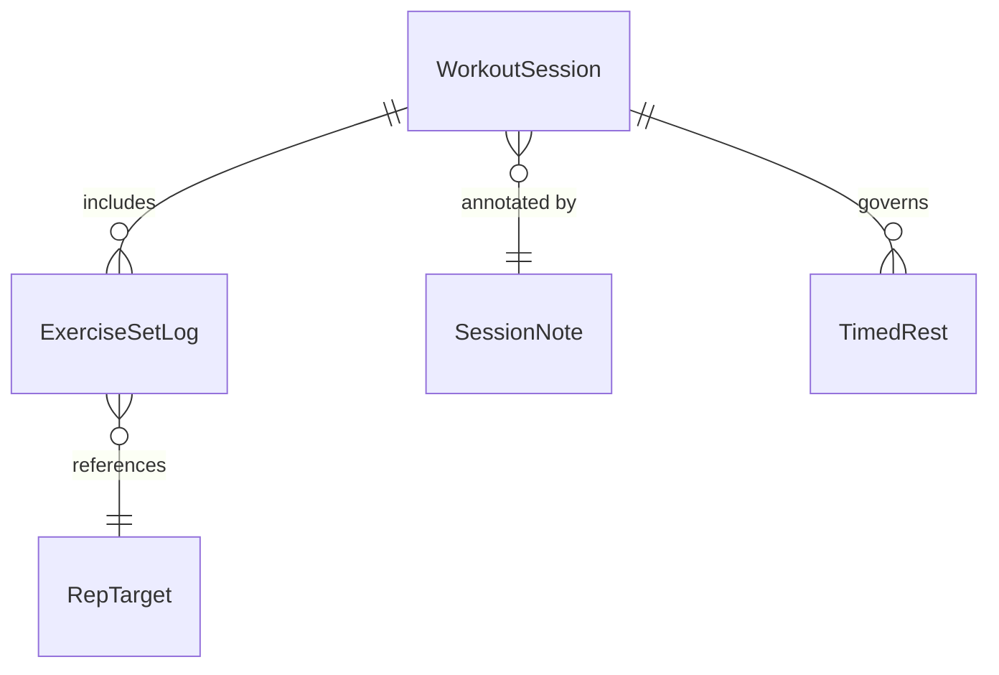

# Domain/WorkoutSession.md

Gainz ▸ **Workout Session Aggregate & API**
*Last updated: 2025‑05‑27*

---

## 1. Purpose

A **WorkoutSession** encapsulates every action the athlete performs from the moment they tap “Start Workout” until they end or abandon the session. It is the domain‑layer *aggregate root* that links realtime set logging, intra‑session metrics, and post‑workout analytics. The model is designed for hypertrophy‑driven training; it deliberately excludes HRV, recovery scores, or bar‑velocity data to keep the aggregate lean and platform‑agnostic.

---

## 2. Conceptual Model



* **WorkoutSession** – Aggregate root stamped with `startDate`, optional `endDate`, and `templateID` (if spawned from a predefined plan).
* **ExerciseSetLog** – Individual performance record: exercise ID, set index, load, reps, RPE, notes.
* **TimedRest** – Optional timer events emitted when the athlete requests automatic rest countdowns.
* **SessionNote** – Free‑text field for intra‑ or post‑workout reflections.

> **Invariant:** A session may contain 0..n ExerciseSetLogs; at least one log is required before a session can be `completed`.

---

## 3. Domain Object Definition

```swift
public struct WorkoutSession: Identifiable, Equatable, Codable {
    public enum State: String, Codable {
        case inactive      // Not yet started
        case inProgress    // Logging sets
        case paused        // Temporarily suspended
        case completed     // Marked done by user
        case abandoned     // Closed without completion
    }

    public let id: UUID
    public var templateID: UUID?
    public var startDate: Date
    public var endDate: Date?
    public var state: State
    public private(set) var setLogs: [ExerciseSetLog]
    public private(set) var notes: [SessionNote]

    // MARK: – Mutating API
    public mutating func logSet(_ set: ExerciseSetLog) { … }
    public mutating func addNote(_ note: SessionNote) { … }
    public mutating func pause() { … }
    public mutating func resume() { … }
    public mutating func complete() { … }
    public mutating func abandon() { … }
}
```

### 3.1 ExerciseSetLog

```swift
public struct ExerciseSetLog: Identifiable, Equatable, Codable {
    public enum EffortMetric: Codable { case rpe(Double), rir(Int) }

    public let id: UUID
    public let exerciseID: UUID
    public let setIndex: Int
    public let load: Double // kilograms
    public let reps: Int
    public let effort: EffortMetric
    public let timestamp: Date
}
```

---

## 4. State Machine

| Current → Action            | Next State | Guard Conditions         |
| --------------------------- | ---------- | ------------------------ |
| `inactive` → `start()`      | inProgress |                          |
| `inProgress` → `pause()`    | paused     |                          |
| `paused` → `resume()`       | inProgress |                          |
| `inProgress` → `complete()` | completed  | ≥1 ExerciseSetLog exists |
| `inProgress` → `abandon()`  | abandoned  |                          |
| `paused` → `abandon()`      | abandoned  |                          |

Failed guard throws a `WorkoutSessionError.invalidTransition` per `DomainError` protocol.

---

## 5. Persistence Contracts

* Implemented in **CorePersistence** using Core Data + CloudKit mirror.
* Sessions persist atomically; setLogs saved as ordered to‑many relationship.
* Soft‑delete policy: `abandoned` or `completed` sessions are retained; never hard‑delete.

---

## 6. Analytics Hooks

`AnalyticsService` listens to Combine publisher `WorkoutSessionPublisher` for:

* `.setLogged(setLog)` – triggers PR checks & volume updates.
* `.sessionCompleted(session)` – updates calendar streaks.

*No telemetry around HRV, recovery, or velocity is gathered.*

---

## 7. Concurrency Rules

`WorkoutSession` mutations are queued on a dedicated serial `DomainQueue.workout`, then emitted to UI via `@Published` replicas to avoid data races.

---

## 8. Unit Testing Checklist

* Successful state transitions (matrix above) ✔︎
* Guard failures throw correct error ✔︎
* Codable round‑trip parity ✔︎
* Equatability on deep structures ✔︎

Use `WorkoutSessionTests.swift`; target ≥90 % line coverage.

---

## 9. JSON Schema (Sample)

```json
{
  "id": "2D45F296-…",
  "templateID": "F1B9…",
  "startDate": "2025-05-27T14:05:23Z",
  "endDate": "2025-05-27T15:12:04Z",
  "state": "completed",
  "setLogs": [
    {
      "id": "CF8…",
      "exerciseID": "BENCH-123",
      "setIndex": 1,
      "load": 102.5,
      "reps": 8,
      "effort": { "rpe": 9.0 },
      "timestamp": "2025-05-27T14:07:30Z"
    }
  ],
  "notes": [
    { "id": "9E5…", "text": "Felt strong today", "timestamp": "2025-05-27T15:10:00Z" }
  ]
}
```

---

*Keep this file as the single source of truth for WorkoutSession semantics. Any changes require bumping Domain API minor version and notifying downstream feature owners.*

